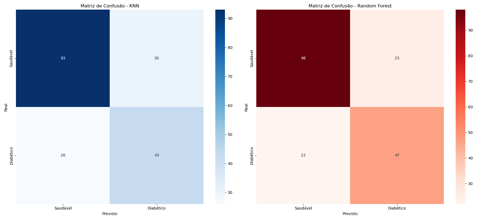
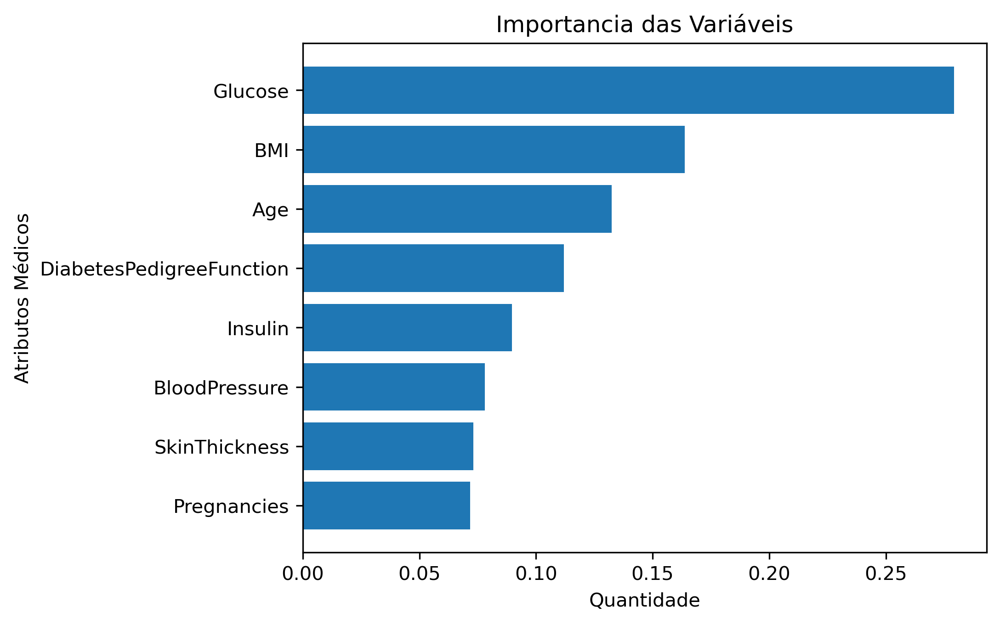
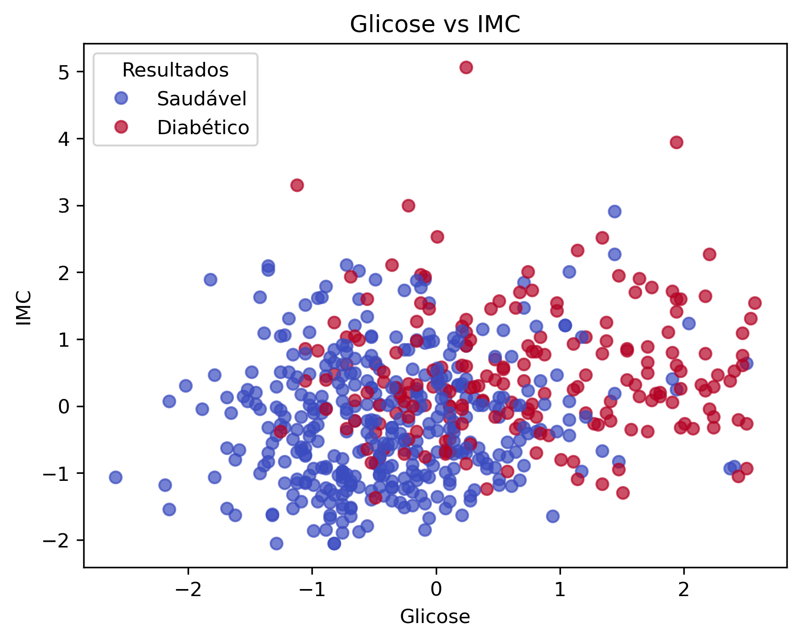

# 🩺 Predição de Diabetes: Um Estudo Comparativo de Machine Learning

Este repositório contém um projeto focado no desenvolvimento de modelos de classificação para prever a ocorrência de diabetes em pacientes. O objetivo principal foi aplicar técnicas de pré-processamento de dados e comparar a performance entre algoritmos baseados em distância (KNN) e baseados em regras (Random Forest).

## 🚀 O Desafio
O conjunto de dados utilizado foi o *Pima Indians Diabetes Dataset*. O maior desafio foi lidar com dados inconsistentes (valores "0" em variáveis onde isso é impossível) e com a diferença de escala entre os atributos médicos.

## 🛠️ Tecnologias Utilizadas
* **Python** (Linguagem principal)
* **Pandas & NumPy** (Manipulação e limpeza de dados)
* **Scikit-Learn** (Pré-processamento e Machine Learning)
* **Matplotlib & Seaborn** (Visualização de dados)

## 🧪 Fluxo de Trabalho (Pipeline)

### 1. Tratamento de Dados "Sujos"
Identifiquei que colunas críticas como `BMI` (IMC), `Glucose` e `Insulin` continham valores zero.
* **Solução:** Substituí esses zeros por `NaN` e utilizei o `SimpleImputer` com a estratégia de **mediana** para preencher as lacunas sem distorcer a distribuição dos dados.

### 2. Engenharia de Atributos e Escalonamento
Para o algoritmo KNN, a escala dos dados é fundamental. 
* **Ação:** Apliquei o `StandardScaler` para normalizar os dados (Z-score), garantindo que variáveis com grandes amplitudes não dominassem o cálculo de distância do modelo.

### 3. Modelagem e Comparação
Comparei dois modelos distintos para entender o comportamento das predições:
* **KNN (K=3):** Sensível à vizinhança e à densidade dos dados.
* **Random Forest:** Um modelo robusto de *ensemble* que utiliza múltiplas árvores de decisão.

## 📊 Resultados e Performance

Após os testes, o **Random Forest** superou o KNN em todas as métricas principais, especialmente no **Recall da Classe 1** (identificação de diabéticos), o que é vital em contextos médicos.

| Modelo | Acurácia | Recall (Classe 1) | Precision (Classe 1) |
| :--- | :---: | :---: | :---: |
| KNN (K=3) | 71% | 62% | 59% |
| **Random Forest** | **76%** | **68%** | **65%** |

### 🔍 Importância das Variáveis
Através do Random Forest, identifiquei que a **Glicose**, o **IMC** e a **Idade** foram os fatores mais decisivos para o diagnóstico. Isso valida o modelo, pois coincide com os principais indicadores de risco na literatura médica.

## 📈 Visualizações Inclusas
* Matrizes de Confusão para análise de Falsos Negativos.
* Gráfico de dispersão (Glicose vs IMC) mostrando a fronteira de decisão.
* Ranking de Importância de Variáveis.

---
**Foco do Projeto:** Estudo de Machine Learning, Pré-processamento de dados e Avaliação de Métricas Clínicas.
